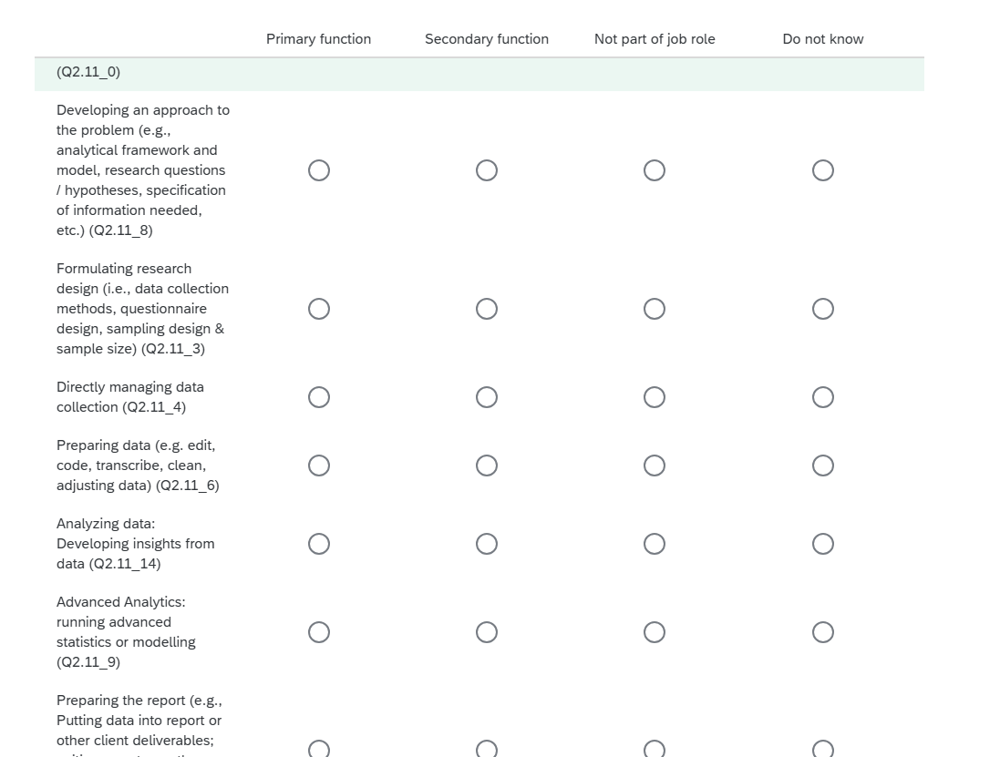
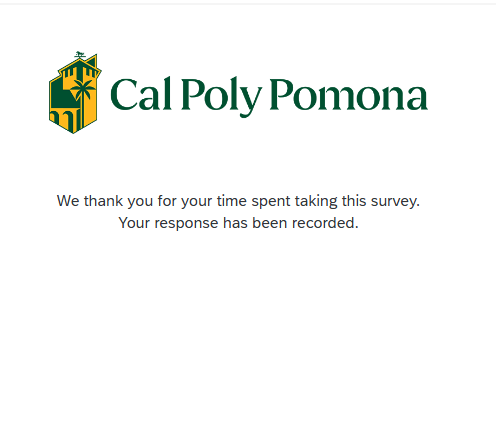

## Proof of sharing with Professor Jae Jung

## Beginning of survey

## Middle of survey

## End of survey

# Appendix {#sec-appendix}

## GitHub Pages

**GitHub Pages URL:** <https://brahhmen55.github.io/school/>

## GitHub Repository

**GitHub Repository URL:** <https://github.com/Brahhmen55/Qualtrics-M01-1>
